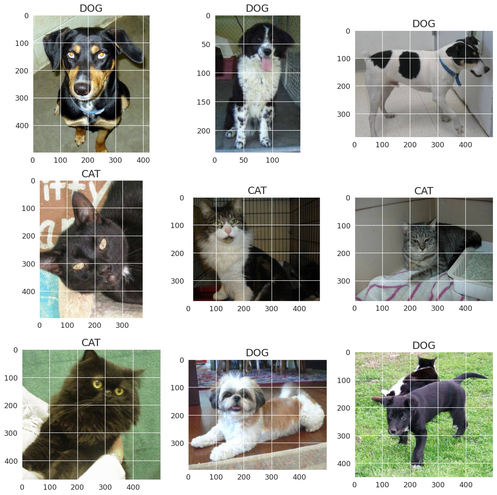

# CAT DOG CLASSIFICATION
<a href="https://colab.research.google.com/github/datvodinh10/Cat-Dog-Classification/blob/main/Cat_Dog.ipynb" target="_parent"></a>
## Introduction
Classify between a Dog and Cat in each image
<!--  -->


## Contributor
```
1. Võ Đình Đạt             | Dat.vd2148902sis.hust.edu.vn
2. Trần Quốc Đệ            | De.tq210179@sis.hust.edu.vn
3. Phạm Quang Nguyên Hoàng | Hoang.pqn214901@sis.hust.edu.vn
4. Đường Minh Quân         | Quan.dm210710@sis.hust.edu.vn
5. Phạm Ngọc Quân          | Quan.pn210704@sis.hust.edu.vn

```

## Dataset
```
https://www.kaggle.com/competitions/dog-vs-cat-classification
```

## How to run
### `Google Colab`
- Step 1: Open notebook, press Run in Colab:
<a href="https://colab.research.google.com/github/datvodinh10/Cat-Dog-Classification/blob/main/Cat_Dog.ipynb" target="_parent"></a>

- Step 2: Save a copy in order to run.

- Step 3: Run notebook (prefer GPU runtime and High RAM for faster training).

## `Local Machine`
- Install requirement:
```
pip install requirements.txt
```

- Open `src/Cat_Dog.ipynb`

- Press `Run all`

NOTE: Require GPU or at least 32Gb RAM and CPU to run local.


